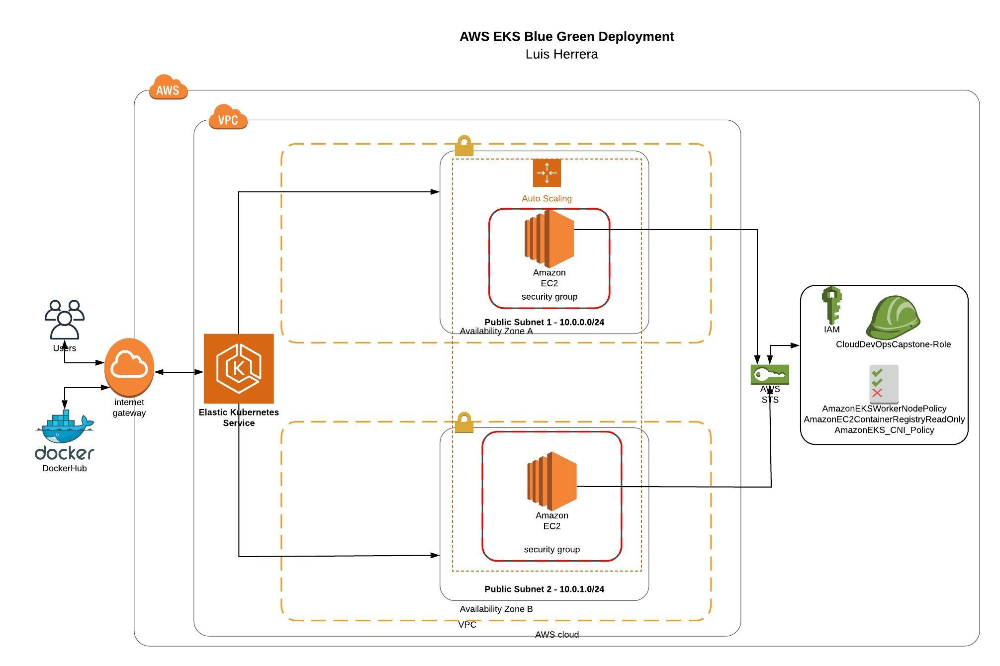

## AWS Elastic Kubernetes Service - Blue Green Deployment

 

In this project you will apply the skills and knowledge which were developed throughout the Cloud DevOps Nanodegree program. These include:

* Working in AWS
* Using Jenkins to implement Continuous Integration and Continuous Deployment
* Building pipelines
* Working with CloudFormation to deploy clusters
* Building Kubernetes clusters
* Building Docker containers in pipelines

---
### Setting your AWS infrastructure

For deploy your infrastructure execute the next script inside cloudformation/ folder:

    sh ./create.sh CloudDevOpsCapstone network_and_eks.yml network_and_eks.json
    
Note: The creation of EKS cluster takes almost 10 minutes

### Setting your pipeline for lint, build and publish your docker image

In order to create your pipeline you have to add the file `Jenkinsfile` in jenkins, also before run the pipeline you have to do login in Docker for publish image task

### Blue Green deployment configuration is setting in Kubernetes using HAProxy Ingress and Deployments and Services

**Enter in the folder blue-green/**

1) Install HAProxy Ingress Controller
    
    `kubectl apply -f 1_haproxy-ingress.hapee.yaml`
    
2) Install deployment of app v1
    
    `kubectl apply -f 2_app-v1.yaml`
    
3) Install deployment of app v2

    `kubectl apply -f 3_app-v2.yaml`

4) Install blue service

    `kubectl apply -f 4_blue-service.yaml`

5) Install green service

    `kubectl apply -f 5_green-service.yaml`

6) Install ingress

    `kubectl apply -f 6_ingress.yaml`

7) Expose ingress controller with a load balancer service

    `sh ./7_expose_url_with_load_balancer.sh`

   Then you can know the **EXTERNAL-IP** and check the application deployed in your browser with the paths: 
   *    /     
   *    /blue

### Notes

* In order to do a blue-green deployment update the section to **version** in `4_blue-service.yaml` and `5_green-service.yaml` files

* Another way is doing a new deploy of an deployment with the respective service and then add a new `path` in  `6_ingress.yaml` file

---
**You can see the execution results in [images](https://github.com/herrera-luis/eks-blue-green-deployment/tree/master/images) folder**
