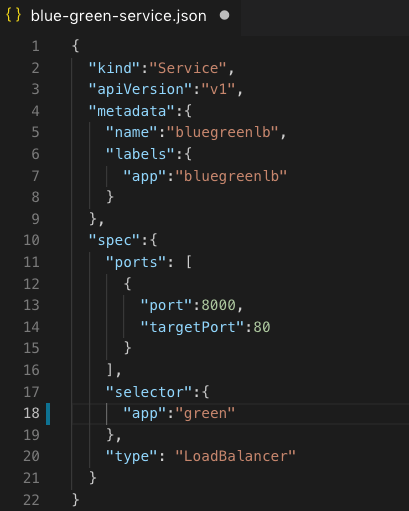
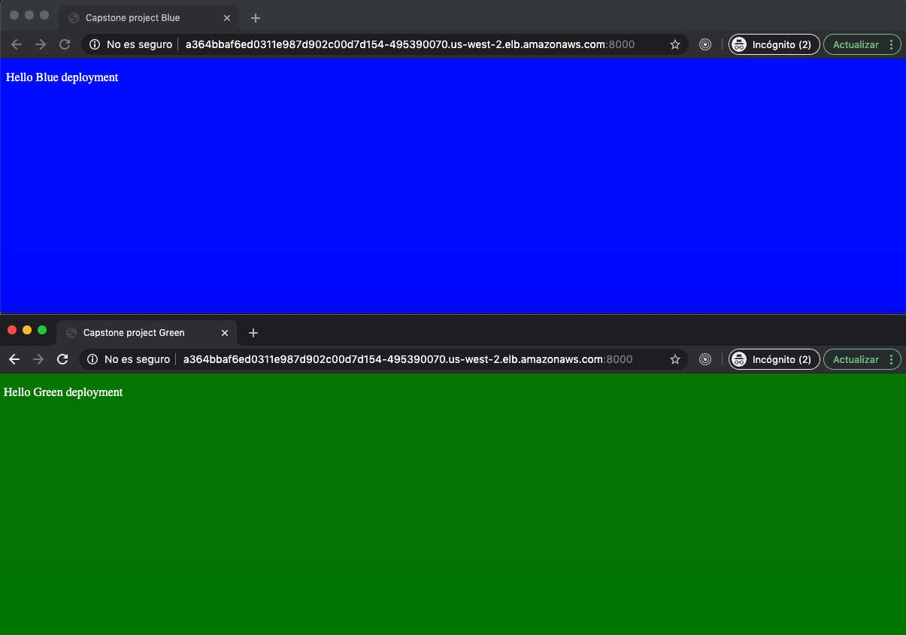

## Execution results

## AWS
### Deploying AWS infrastructure
 

### Checking state of resources in Cloudformation
 

### Checking EKS cluster and Nodes

---
##Jenkins Pipeline
### Running pipeline lint step
 

### Running pipeline build and publish Docker image step
 

### Docker images in DockerHub
  

---
## EKS 
### Connecting local machine to EKS
 

### Getting Nodes of EKS Cluster
 

### Setting controller blue green
 

### Getting services deployed

### Checking green deployment

### Doing a change to blue-green-service.json for blue deploy
 

### After do: kubectl apply -f blue-green-service.json

